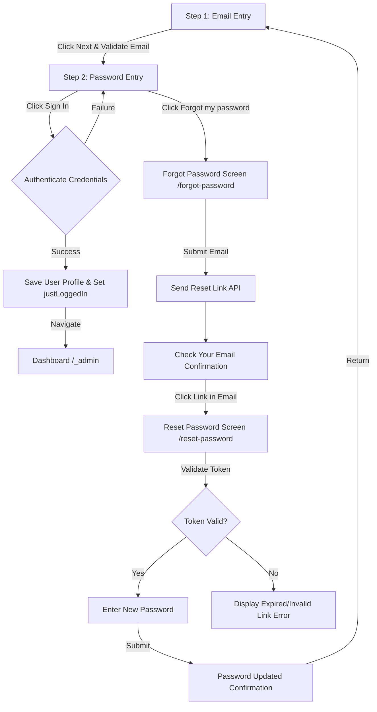

# Authentication & Password Reset Feature Documentation

## Overview

The Authentication & Password Reset module manages administrator sign-in, account validation, self-service password reset, and setting changes for the QCU Microsoft Student Community (MSC) Admin Portal. 

It adheres strictly to **Microsoft Fluent Design System** standards with zero border radius (`rounded-none`), outlined floating notch input controls, centered brand headers, and 60fps Framer Motion height transitions.

---

## Directory Structure

```
src/
├── features/
│   └── auth/
│       ├── components/
│       │   ├── AuthLayout.tsx           # Persistent background & layout wrapper
│       │   ├── LoginForm.tsx            # Multi-step sign-in form (Step 1 Email, Step 2 Password)
│       │   ├── ForgotPasswordForm.tsx   # Password reset request form & confirmation
│       │   ├── ResetPasswordForm.tsx    # New password entry form & token verification
│       │   └── ChangePasswordModal.tsx  # In-app settings password update dialog
│       ├── hooks/
│       │   ├── useAutoHeight.ts         # ResizeObserver dynamic height tracking hook
│       │   ├── useLoginForm.ts          # Step management, validation, login submission
│       │   ├── useForgotPasswordForm.ts # Forgot password request state & API integration
│       │   ├── useResetPasswordForm.ts  # Token verification & password reset logic
│       │   └── useChangePasswordForm.ts # Password change state & validation
│       ├── schemas/
│       │   ├── loginSchema.ts           # Zod schema for email & password validation
│       │   ├── forgotPasswordSchema.ts  # Zod schema for forgot password email input
│       │   ├── resetPasswordSchema.ts   # Zod schema for reset password token & confirmation
│       │   └── changePasswordSchema.ts  # Zod schema for changing active passwords
│       ├── services/
│       │   └── authApi.ts               # Axios API client functions for auth endpoints
│       └── types/
│           └── authTypes.ts             # TypeScript interfaces for API payloads & models
└── routes/
    ├── login.tsx                       # Route for /login
    ├── forgot-password.tsx              # Route for /forgot-password
    ├── reset-password.tsx               # Route for /reset-password
    ├── auth.reset-password.tsx          # Route alias for /auth/reset-password (email links)
    └── _admin.tsx                       # Guarded admin layout with post-login card expansion
```

---

## Flow & Architecture

### User Authentication State Machine



---

## Technical Details

### 1. Form Validation Architecture

Form validation is decoupled from component rendering and handled using **Zod** schemas. All Zod errors return custom human-readable strings via `{ message: "..." }` to prevent Zod internal errors from reaching the user interface.

Example schema definition ([`src/features/auth/schemas/resetPasswordSchema.ts`](file:///home/youki/github/msc-qcu-admin-frontend/src/features/auth/schemas/resetPasswordSchema.ts)):

```typescript
import { z } from "zod";

export const resetPasswordSchema = z
  .object({
    token: z.string().min(1, { message: "Reset token is required." }),
    newPassword: z
      .string()
      .min(8, { message: "Password must be at least 8 characters long." }),
    confirmPassword: z.string(),
  })
  .refine((data) => data.newPassword === data.confirmPassword, {
    message: "Passwords do not match.",
    path: ["confirmPassword"],
  });
```

### 2. Smooth Container Animations (`useAutoHeight`)

To eliminate container clipping and layout snapping when form states or routes change, the outer card container uses explicit CSS height animation driven by a custom `ResizeObserver` hook ([`src/features/auth/hooks/useAutoHeight.ts`](file:///home/youki/github/msc-qcu-admin-frontend/src/features/auth/hooks/useAutoHeight.ts)).

```typescript
import { useState, useRef, useLayoutEffect } from "react";

export function useAutoHeight<T extends HTMLElement = HTMLDivElement>() {
  const contentRef = useRef<T>(null);
  const [height, setHeight] = useState<number | "auto">("auto");

  useLayoutEffect(() => {
    const element = contentRef.current;
    if (!element) return;

    const resizeObserver = new ResizeObserver((entries) => {
      for (const entry of entries) {
        const borderBoxHeight = entry.borderBoxSize?.[0]?.blockSize;
        const contentHeight = borderBoxHeight ?? entry.contentRect.height;
        if (contentHeight > 0) {
          setHeight(contentHeight);
        }
      }
    });

    resizeObserver.observe(element);
    return () => resizeObserver.disconnect();
  }, []);

  return { contentRef, height };
}
```

#### Step Transition Sequence

Inside each form component, step changes execute a 3-stage sequence via Framer Motion `AnimatePresence`:

1. **Fade Out**: Current view fades to 0 opacity (`exit={{ opacity: 0, transition: { duration: 0.12 } }}`).
2. **Height Transition**: `useAutoHeight` detects inner height changes and `motion.div` smoothly animates height (`animate={{ height }} transition={{ duration: 0.35 }}`).
3. **Fade In**: Incoming view fades in from 0 to 100% opacity (`animate={{ opacity: 1, transition: { delay: 0.12 } }}`).

---

## Route & Layout Integration

### Persistent Background Wrapper (`AuthLayout.tsx`)

All authentication routes (`/login`, `/forgot-password`, `/reset-password`, `/auth/reset-password`) are wrapped in `AuthLayout`. This maintains the background stock photo and backdrop blur without unmounting during page navigation.

### Cross-Route Card Morphing (`layoutId="auth-card"`)

Card containers across form components share `layoutId="auth-card"`. Framer Motion uses FLIP animations to morph the card dimensions smoothly across route navigations.

### Post-Login Dashboard Expansion

When a user signs in:
1. `useLoginForm` measures `cardRef.current.offsetHeight` and writes `loginCardHeight` to `sessionStorage`.
2. `sessionStorage.setItem("justLoggedIn", "true")` triggers Stage 0 in `src/routes/_admin.tsx`.
3. `_admin.tsx` initializes Stage 0 at `savedCardHeight` (e.g. `390px`) and smoothly expands the card to `100vh` full-screen dashboard mode without layout jumps.

---

## API Integration Endpoints

All authentication API calls bridge to the backend server via `src/features/auth/services/authApi.ts`:

| Method | Endpoint | Description |
| :--- | :--- | :--- |
| `POST` | `/api/v1/auth/login` | Authenticates email & password, sets HTTP-only session cookies. |
| `POST` | `/api/v1/auth/forgot-password` | Generates a reset token and sends an email via Google SMTP. |
| `GET` | `/api/v1/auth/validate-reset-token` | Verifies reset token validity and returns token user metadata. |
| `POST` | `/api/v1/auth/reset-password` | Updates user password given a valid reset token. |
| `POST` | `/api/v1/auth/change-password` | Updates authenticated user password. |

---

## Developer Guidelines

When adding new authentication forms or modifying existing layouts:

1. **Always Use `rounded-none`**: Strictly preserve zero border radius on all containers, input boxes, action buttons, and badges.
2. **Maintain Outlined Input Styling**: Use full 4-side outlined input containers (`border border-muted-foreground/60 rounded-none focus:border-primary`) with floating notch labels.
3. **Use `useAutoHeight` for Containers**: Wrap the outer card in `<motion.div animate={{ height }}>` and attach `contentRef` to the inner padding wrapper.
4. **Enforce Separation of Concerns**: Keep Zod schemas in `schemas/`, API calls in `services/`, form hooks in `hooks/`, and view components in `components/`.
