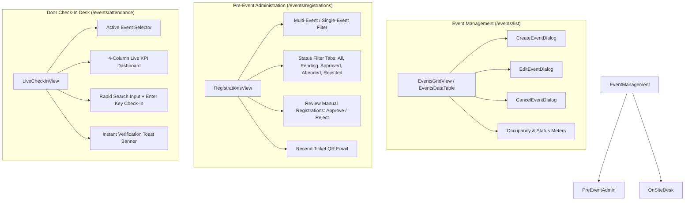

# Event Logistics & Attendee Management

Comprehensive architectural and implementation guide for the Event Logistics, Attendee Ticketing, and Door Check-In subsystems in the QCU MSC Admin Portal.

---

## 1. Architectural Overview

The Event Logistics feature vertical slice (`src/features/logistics/`) provides end-to-end tooling for event planning, tiered registration windows, capacity tracking, pre-event attendee administration, and on-site door verification.

### Subsystem Flow Diagram



---

## 2. Directory Structure

```
src/features/logistics/
├── components/
│   ├── CancelEventDialog.tsx      # Modal to cancel events with required broadcast reason
│   ├── CreateEventDialog.tsx      # Modal to create events with tiered schedules and cover photo URL
│   ├── EditEventDialog.tsx        # Modal to modify event specifications and schedules
│   ├── EventAttendeesTab.tsx      # Inline attendee roster tab in master-detail view
│   ├── EventCard.tsx              # Master-detail event list item card
│   ├── EventDetails.tsx           # Detail view container for selected event
│   ├── EventFilterBar.tsx         # Quick filter pill toolbar (All, Active, Public, Members Only)
│   ├── EventGridCard.tsx          # Card with cover banner, occupancy meter, and status badges
│   ├── EventList.tsx              # Scrollable list container for event master pane
│   ├── EventOverviewTab.tsx       # Detailed specifications overview pane
│   ├── EventsDataTable.tsx        # Tabular data grid view with column sorting and search
│   ├── EventsGridView.tsx         # Responsive grid container for event cards
│   ├── FullRosterView.tsx         # Full-width attendee list table with batch actions
│   ├── LiveCheckInView.tsx        # Real-time door check-in desk with KPI cards and rapid lookup
│   ├── RegistrationsView.tsx      # Pre-event attendee ticketing management with status filtering
│   └── index.ts                   # Public component exports
├── hooks/
│   ├── useEventDetails.ts         # Hook for fetching single event metadata and occupancy
│   ├── useEventMutations.ts       # TanStack Query mutations (create, update, cancel, approve, checkin)
│   ├── useEventRegistrations.ts   # Infinite query hook with debounced search and status filters
│   └── useEvents.ts               # Hook for fetching active/all events list
├── schemas/
│   └── eventSchemas.ts            # Zod validation schemas with custom human-readable error messages
├── services/
│   └── eventApi.ts                # API client bridge to /api/v1/events endpoints
└── types/
    └── index.ts                   # TypeScript interfaces and domain models
```

---

## 3. Data Models & Validation Schemas

### Domain Types (`src/features/logistics/types/index.ts`)

```typescript
export type EventType = "PUBLIC" | "MEMBERS_ONLY";
export type EventStatus = "ACTIVE" | "CANCELLED" | "COMPLETED";
export type RegistrationStatus = "PENDING_REVIEW" | "APPROVED" | "REJECTED" | "CANCELLED";

export interface EventItem {
  id: string;
  title: string;
  description: string | null;
  image?: string | null;
  date: string;
  priorityStartDate: string;
  generalStartDate: string;
  type: EventType;
  status: EventStatus;
  maxCapacity: number;
  registeredCount: number;
  attendedCount: number;
  spotsRemaining: number;
  venue?: string;
  registrationOpen: boolean;
  requiresQrTicket: boolean;
  createdAt: string;
  updatedAt: string;
}

export interface EventRegistration {
  id: string;
  eventId: string;
  eventTitle?: string;
  userId?: string | null;
  studentId?: string | null;
  name: string;
  email: string;
  status: RegistrationStatus;
  hasAttended: boolean;
  attendedAt?: string | null;
  isMember: boolean;
  createdAt: string;
}
```

### Zod Validation Rules (`src/features/logistics/schemas/eventSchemas.ts`)

* **Timeline Consistency:** Validates that `priorityStartDate <= generalStartDate <= date`.
* **Title & Capacity:** Enforces minimum 3 characters for title and positive integer for capacity.
* **Custom Error Messages:** All validation errors use `{ message: "..." }` to avoid raw schema internals leaking to the UI.

---

## 4. Key Workflows & Views

### A. Events Directory (`/events/list`)

1. **Card View (`EventsGridView`):**
   * Renders `EventGridCard` with an expanded 176px (`h-44`) cover photo header.
   * Visual occupancy progress bar (`registeredCount / maxCapacity`).
   * Quick status switch to toggle registrations.
   * Dropdown options menu with Edit, View Registrations, and Cancel actions.

2. **Table View (`EventsDataTable`):**
   * High-density tabular layout for rapid sorting and filtering.
   * Role-gated actions (Superadmin & Logistics Head can cancel/edit).

### B. Attendee Registrations & Review (`/events/registrations`)

1. **Multi-Event & Single-Event Filtering:**
   * Dropdown selector enables viewing registrations across all active events or isolating a single event.
2. **Status Lifecycle Tabs:**
   * `All`, `Pending Review`, `Approved`, `Attended`, `Rejected`.
3. **Manual OCR Verification Review:**
   * When an applicant's OCR fails during public intake, their registration enters `PENDING_REVIEW`.
   * Admins review and click `[Approve]` (triggers QR ticket issuance email) or `[Reject]`.

### C. Live Check-In Desk (`/events/attendance`)

1. **Active Event Selector:**
   * Switches the active entrance desk to any upcoming or ongoing event.
2. **4-Column KPI Dashboard Grid:**
   * **Checked In:** Displays current arrivals vs. venue capacity with capacity percentage filled.
   * **Confirmed Regs:** Total approved attendee tickets.
   * **Pending Arrival:** Remaining expected attendees.
   * **Turnout Rate:** Live percentage of arrivals vs. confirmed registrants.
3. **Rapid Lookup & Entry:**
   * Autofocused search input supports typing Student IDs (e.g. `23-1178`) or attendee names.
   * Pressing `Enter` automatically checks in the attendee when an exact match is resolved.
   * Displays an immediate green verification banner upon entry.

---

## 5. API Services & Backend Alignment

All requests are dispatched via `src/features/logistics/services/eventApi.ts`:

* `GET /api/v1/events` -> `fetchEvents(all?: boolean)`
* `GET /api/v1/events/:eventId` -> `fetchEventById(eventId)`
* `POST /api/v1/events` -> `createEvent(data)`
* `PATCH /api/v1/events/:eventId` -> `updateEvent(eventId, data)`
* `DELETE /api/v1/events/:eventId` -> `cancelEvent(eventId, data)`
* `GET /api/v1/events/:eventId/registrations` -> `fetchEventRegistrations(params)`
* `PATCH /api/v1/events/:eventId/registrations/:id/approve` -> `approveRegistration` (`{ action: "approve" }`) & `rejectRegistration` (`{ action: "reject" }`)
* `PATCH /api/v1/events/:eventId/registrations/:id/checkin` -> `checkInAttendee(eventId, id)`
* `PATCH /api/v1/events/:eventId/registrations/checkin` -> `checkInByQr(eventId, qrPayload)`

---

## 6. Design System Conformance

* **Typography & Tokens:** Built strictly with Microsoft Fluent tokens (`p-size200`, `gap-size160`, `shadow-4`, `shadow-8`).
* **Icons:** Powered exclusively by `@fluentui/react-icons` (`CalendarRegular`, `PeopleCheckmarkRegular`, `LocationRegular`, `ImageRegular`).
* **Feedback:** Sonner notifications (`toast.success`, `toast.error`) provide immediate feedback on all mutations without disrupting the user flow.
