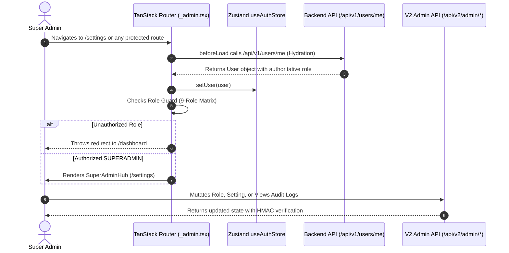

# Super Admin Settings Hub & 9-Role RBAC System

Comprehensive architectural and implementation guide for the Super Admin Hub, authoritative session hydration, 9-role access matrix, system settings switches, and HMAC-SHA256 chained audit logs.

---

## 1. Architectural Overview

The Super Admin subsystem (`src/features/admin/`) manages platform-wide security, global feature toggles, user privilege escalation/demotion, and cryptographic audit compliance.

### Security & Hydration Flow



---

## 2. Directory Structure

```
src/features/admin/
├── components/
│   ├── AuditLogsTab.tsx          # HMAC-SHA256 chained audit trail with integrity indicator
│   ├── RoleManagementTab.tsx     # User table with search, role filters, and mutation modal
│   ├── SuperAdminHub.tsx         # Main hub container with Fluent Pivot tabs
│   └── SystemSettingsTab.tsx     # Card-based global switches with live mutation feedback
├── hooks/
│   ├── useAdminSettings.ts       # TanStack Query hook for global system settings
│   ├── useAdminUsers.ts          # TanStack Query hook for user list and role mutation
│   └── useAuditLogs.ts           # TanStack Query hook for cryptographic audit records
├── schemas/
│   └── adminSchemas.ts           # Zod validation schemas for settings and role changes
├── services/
│   └── adminApi.ts               # API client bridge to /api/v2/admin endpoints
└── types/
    └── adminTypes.ts             # TypeScript definitions for V2 models and audit logs
```

---

## 3. The 9-Role Authorization Matrix

Roles are defined in [`src/types/roles.ts`](file:///home/youki/Documents/GitHub/msc-qcu-admin-frontend/src/types/roles.ts):

| Role Identifier | Display Label | Sidebar & Route Access |
| :--- | :--- | :--- |
| `SUPERADMIN` | Super Administrator | Dashboard, Applicants, Members, Events, Settings Hub |
| `ADMIN_HR_HEAD` | HR & Recruitment Head | Dashboard, Applicants, Members |
| `ADMIN_HR` | HR & Recruitment Officer | Dashboard, Applicants, Members |
| `ADMIN_LOGISTICS_HEAD` | Logistics & Events Head | Dashboard, Events (List, Attendance, Registrations) |
| `ADMIN_LOGISTICS` | Logistics Officer | Dashboard, Events (List, Attendance, Registrations) |
| `ADMIN_FINANCE_HEAD` | Finance Head | Dashboard |
| `ADMIN_FINANCE` | Finance Officer | Dashboard |
| `MEMBER` | Active Member | Standard Member Portal (Redirected from Admin UI) |
| `APPLICANT` | Candidate | Application Status Portal (Redirected from Admin UI) |

---

## 4. Authoritative Auth Hydration

### Zustand Auth Store (`src/store/useAuthStore.ts`)

Session state is centralized in `useAuthStore`. Ephemeral browser session storage is used strictly as a fast cache; the server `/api/v1/users/me` response is the single source of truth:

```typescript
interface AuthState {
  user: AuthenticatedUser | null;
  isLoading: boolean;
  setUser: (user: AuthenticatedUser | null) => void;
  clearUser: () => void;
}
```

### Route Guard Enforcement (`src/routes/_admin.tsx`)

Every protected route executes a `beforeLoad` check that calls `hydrateSession()`. If the session is missing or unauthenticated, it redirects to `/login`. Child route guards (such as `/settings`, `/applications`, and `/events/list`) evaluate the user's role and throw redirects if the user lacks permissions.

---

## 5. Hub Tabs & Capabilities

### A. Roles & Permissions Management (`RoleManagementTab.tsx`)

* **Live Search & Filter:** Search by user name, email, or student ID with role category filters.
* **Privilege Mutation Modal:**
  * Displays user context and target role selector.
  * Warns administrators when promoting a user to `SUPERADMIN`.
  * Protects against self-demotion (disables demoting your own active account).
  * Error boundary gracefully surfaces backend 403 errors (e.g., preventing demoting the last remaining Super Admin).

### B. System Switches & Global Controls (`SystemSettingsTab.tsx`)

Manages the core operational flags stored in the backend database:

1. `events_registration_open`: Global switch governing whether students can register for events across the community portal.
2. `merch_shop_open`: Controls access to the merchandise pre-order store.
3. `maintenance_mode`: Places the public-facing portals in maintenance mode while preserving administrative access.

Each switch card displays real-time status indicators, description text, and timestamp metadata.

### C. Cryptographic Audit Trail (`AuditLogsTab.tsx`)

* **HMAC-SHA256 Verification Banner:** Evaluates the backend cryptographic hash chain. If `integrityOk: true`, displays a green `Integrity Verified (HMAC-SHA256 Chained)` shield.
* **Audit Filter Bar:** Filter by action type (`ROLE_CHANGE`, `SETTING_UPDATE`, `SYSTEM_MAINTENANCE`) and date ranges (`from` / `to`).
* **Audit Table:** Inspects timestamp, actor ID, action badge, entity reference, and expandable JSON details showing previous vs. updated values.

---

## 6. API Services (`src/features/admin/services/adminApi.ts`)

All Super Admin operations target `/api/v2/admin/` endpoints using `getApiBaseURL("v2")`:

* `GET /api/v2/admin/users` -> `fetchAdminUsers(params)`
* `PATCH /api/v2/admin/users/:userId/role` -> `updateUserRole(userId, role)`
* `GET /api/v2/admin/settings` -> `fetchSystemSettings()`
* `PATCH /api/v2/admin/settings` -> `updateSystemSettings(key, value)`
* `GET /api/v2/admin/audit-logs` -> `fetchAuditLogs(params)`
